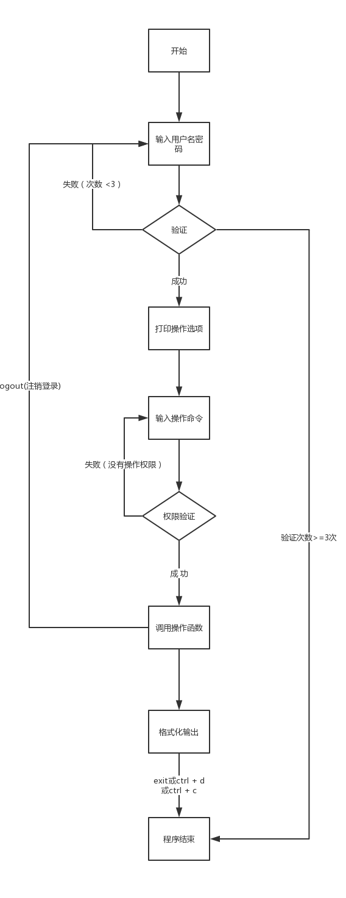

## 用户管理系统 v4
```bash
v4版说明: 
    增删查改全部直接操作数据库
    所以我实现load 和 list 实现方式相似
    用户角色划分功能暂时被移除


全部用函数编程方式进行模块化
1. 登录认证，用户名密码序列化到文件及从文件反序列化（json模块实现）；
2. 提示可选操作，以及示例.
3. 增删改查和搜索
    3.1 增 add           # add monkey 18 132xxx monkey@51reboot.com
    3.2 删 delete        # delete user_name
    3.3 改 update        # update user_name set field_name = value
    3.4 查 list          # list
    3.5 搜 find          # find user_name
4. 格式化输出
5. 分页输出功能(支持回车翻页，跳转到指定页)
6. csv导出
7. 注销登录功能
8. 日志记录功能
    记录用户登录登出
    记录用户增删查改等其他操作(操作成功则记录)
```

#### 项目目录结构
```
.
├── bin
│   └── u_m_s_demo_v4.py
├── lib
│   ├── db_operation.py
│   ├── __init__.py
│   └── utils.py
├── README.md
├── requirements.txt
├── settings.py
└── u_m_s_demo
    ├── __init__.py
    ├── main.py
    └── views.py


u_m_s_demo系统目录划分介绍  
bin --  程序可执行文件存放目录  
    u_m_s_demo_v4.py    --  执行该文件启动系统

lib --  公共模块存放目录

u_m_s_demo  --  存放项目主要的功能函数和逻辑

settings.py --  配置文件，全局的配置在这个文件定义

passwd.ini --  登录时用的账号密码文件(程序运行时自动创建该文件)
```


<br />

## 主逻辑流程图  


<br />

## 功能演示  
请自行参考v3版

<br />
