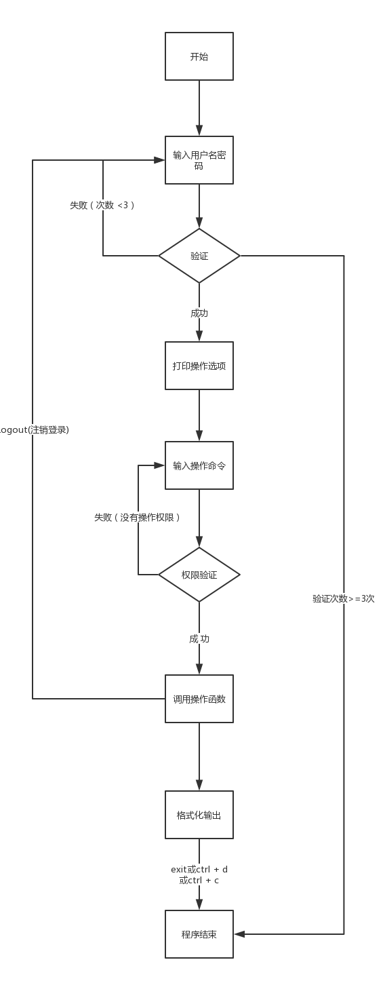
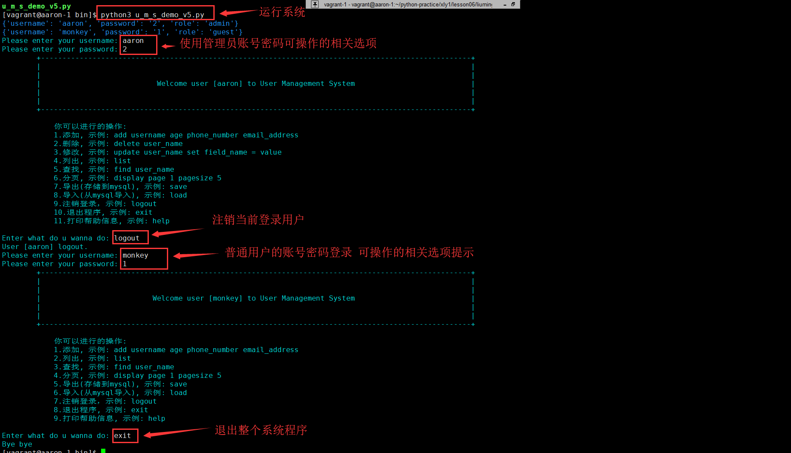
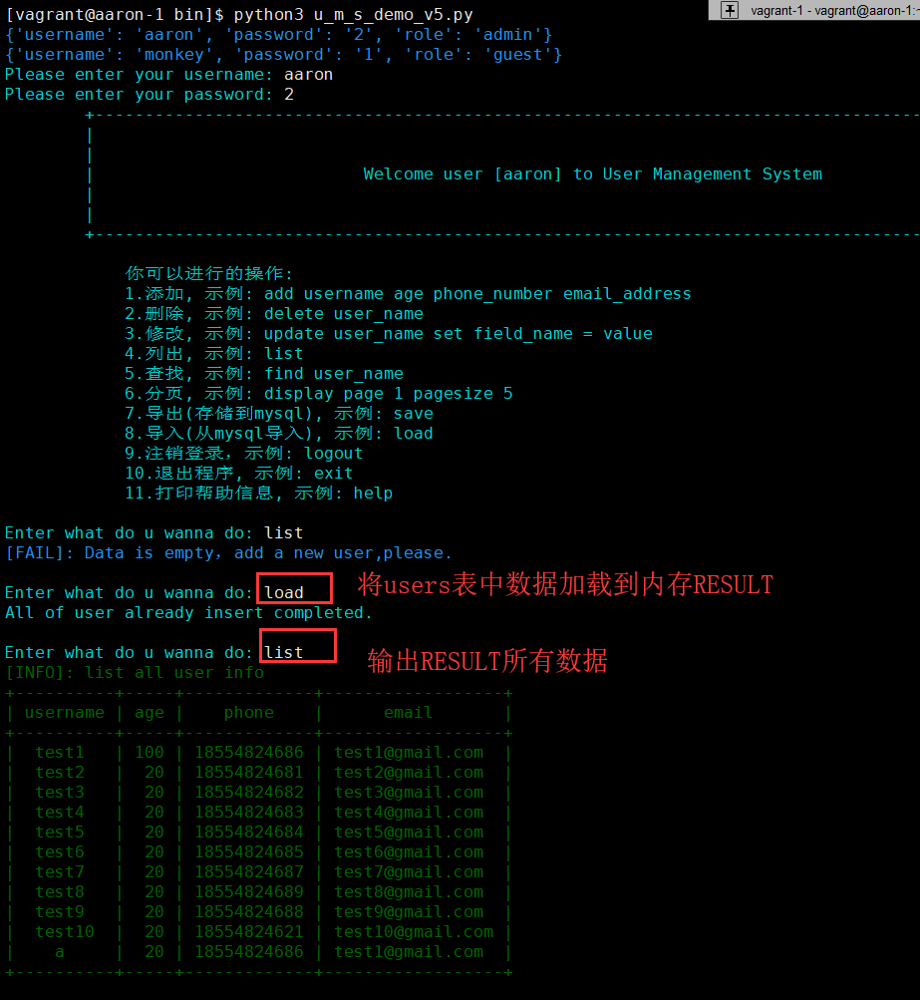
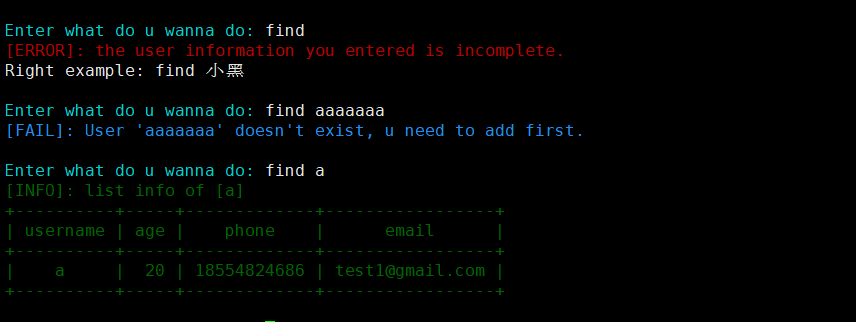
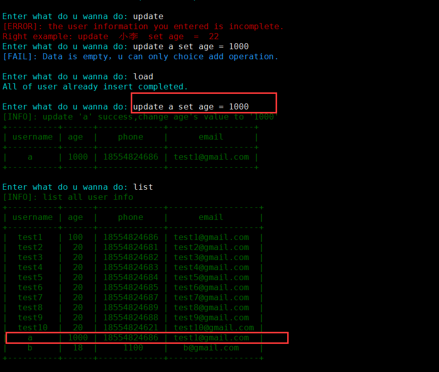
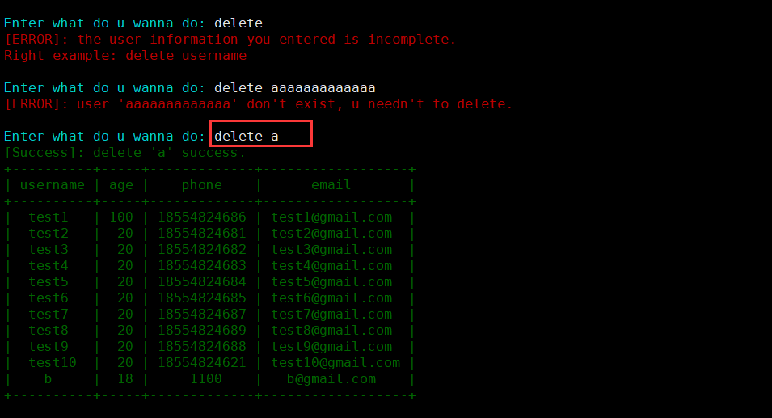
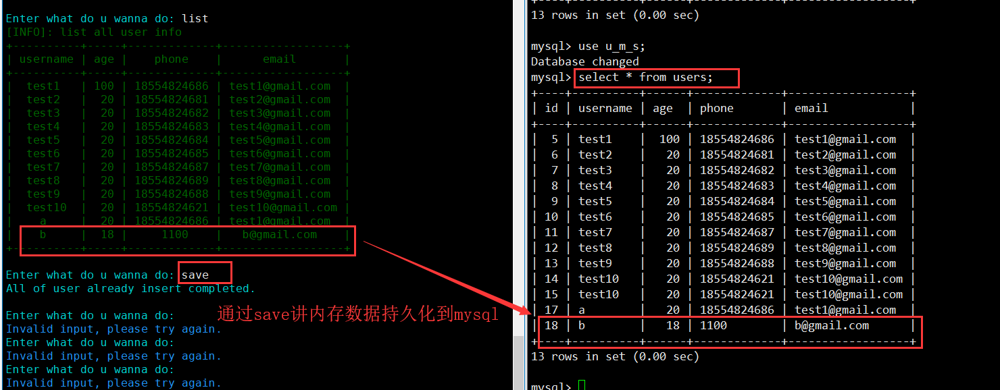

## 用户管理系统 v4
```bash
v5版内存中保存的用户数据结构: 
{"username1": {"field1": "value1", "field2": "value2", " field3": "value3", "field4": "value4"}, }


全部用类进行抽象和 函数编程方式进行模块化
1. 登录认证，权限校验，用户名密码从文件读取（ConfigParse模块实现）；
2. 提示可选操作，以及示例.
3. 用户管理功能(非管理员部分功能不可用)
    3.1 增 add           # add monkey 18 132xxx monkey@51reboot.com
    3.2 删 delete        # delete user_name
    3.3 改 update        # update user_name set field_name = value
    3.4 查 list          # list
    3.5 搜 find          # find user_name
    3.6 分页  page        # page 1 pagesize 5
    3.7 导入  (从数据库加载到内存)  # load
    3.8 导出(从内存持久化到数据库)  # save
    3.9 注销  logout
    3.10 退出  exit
4. 格式化输出
5. 日志记录功能
    记录用户登录登出
    记录用户增删查改等其他操作(操作成功则记录)
```

#### 项目目录结构
```
.
├── bin
│   └── u_m_s_demo_v5.py
├── lib
│   ├── __init__.py
│   └── utils.py
├── README.md
├── requirements.txt
├── settings.py
└── u_m_s_demo
    ├── __init__.py
    ├── main.py
    └── views.py


u_m_s_demo系统目录划分介绍  
bin --  程序可执行文件存放目录  
    u_m_s_demo_v5.py    --  执行该文件启动整个项目

lib --  公共模块存放目录

u_m_s_demo  --  存放项目主逻辑和功能选项模块

settings.py --  配置文件，全局的配置在这个文件定义

passwd.ini --  登录时用的账号密码文件(程序运行时自动创建该文件)
```


<br />

## 主逻辑流程图  


<br />

## 功能演示  
> 登陆成功，切换用户，操作提示，退出程序  


<br />

> 导入功能演示   


<br />

> 增加功能演示  


<br />

> 条件查询功能  


<br />

> 更新功能  


<br />

> 删除功能演示  


<br />

> 导出功能演示  


<br />

> 分页功能演示   


<br />


## 运行文档  

1.修改配置文件  
```bash
# 编辑项目配置文件 settings.py
主要需要修改的参数有 DB_CONN_INFO
```  

<br />


2.创建对应的mysql数据库 库和表  
```bash

# 建库语句
create database u_m_s;

# 建表语句
use u_m_s;

CREATE TABLE `users` (
  `id` int(10) unsigned NOT NULL AUTO_INCREMENT,
  `username` varchar(32) DEFAULT NULL,
  `age` int(11) DEFAULT NULL,
  `phone` varchar(11) DEFAULT NULL,
  `email` varchar(50) DEFAULT NULL,
  PRIMARY KEY (`id`)
) ENGINE=InnoDB AUTO_INCREMENT=18 DEFAULT CHARSET=utf8mb4
```  

<br />


3.开始运行  
```bash
cd liuming/bin
python3 u_m_s_demo_v5.py
```  

<br />

